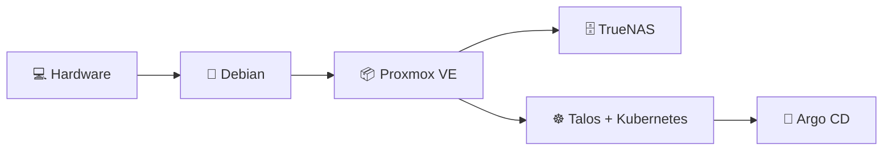
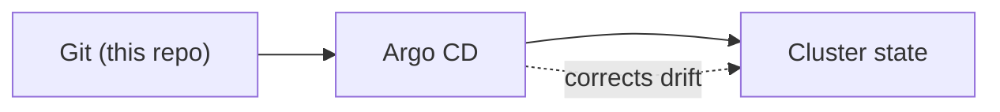
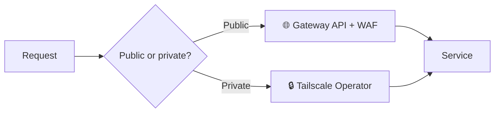

<!-- markdownlint-disable-next-line MD033 MD041 -->

# 🏠 Homelab as Code 👨‍💻

**Bare-metal to a self-healing Kubernetes cluster, every layer as code. This is my homelab.**

The goal is to keep manual steps out of it as much as I can. Ansible and OpenTofu provision the OS layer and VMs, the nodes run Talos Linux, and Argo CD reconciles the cluster against Git. Most changes are a commit, and rebuilding a node means running the same code again.

## ✅ Status

---

## 🧱 Built with Layers

The lab is built bottom to top, and each layer assumes the one under it. A Proxmox VE cluster runs the Talos VMs that form Kubernetes, plus a TrueNAS VM for storage. The lower layers rarely change once they work, while the apps on top change frequently, with updates automated by Renovate Operator.

## 🔁 Kept in Sync with Git

This is the GitOps part. Git holds the desired state and Argo CD does the writing: it is the only thing that applies changes to the cluster, and ApplicationSets generate the apps from `kubernetes/cluster/active`. A rollback is a `git revert`. The one thing kept out of Git is secrets, which the External Secrets Operator pulls from Bitwarden Secrets Manager at runtime.

## 🚪 Two Ways In

Every service picks one of two Ingress paths. Public services come in through the Gateway API, where Envoy Gateway terminates TLS and runs a Coraza WAF. Private ones reside on the Tailnet instead, reachable only from approved devices.

## 🧰 The Stack

| Category | Tools |
| --- | --- |
| 🏗️ Infrastructure as Code (IaC) | OpenTofu, Terragrunt, Ansible |
| 🖥️ Hosts and Virtualization | Proxmox VE, TrueNAS, Talos Linux |
| 🔁 GitOps | Argo CD with ApplicationSets |
| 🌐 Networking | Cilium, CoreDNS, external-dns |
| 🚪 Ingress | Envoy Gateway (public), Tailscale Operator (private) |
| 🔑 Certificates and Secrets | cert-manager, External Secrets Operator (Bitwarden Secrets Manager) |
| 🪪 Identity | Kanidm with Kaniop |
| 💾 Storage | Longhorn, CSI drivers for NFS and SMB |
| 🛢️ Databases | CloudNativePG, mariadb-operator |
| ⚙️ Runner Toolchain | Task, talosctl, kubectl, Helm, Kustomize |

## 📂 What's in the Repo

| Path | Contents |
| --- | --- |
| [`ansible/`](ansible) | Proxmox VE setup and Kubernetes bootstrap playbooks |
| [`debian/`](debian) | Unattended Debian install (preseed) |
| [`Dockerfile`](Dockerfile) | The all-in-one runner image |
| [`kubernetes/`](kubernetes) | GitOps source of truth |
| [`.taskfiles/`](.taskfiles) | Task runner workflows |
| [`terragrunt/`](terragrunt) | Talos VM provisioning, with remote state in Cloudflare R2 |
| [`tofu/`](tofu) | OpenTofu bootstrap for the R2 state bucket |

## 📖 Read More

Tutorials, guides, reference material, and explanations are in the [docs](https://homelab.towerofkubes.com). Deep dives can be found at my [blog](https://www.towerofkubes.com/).

<!-- markdownlint-disable-next-line MD033 -->

