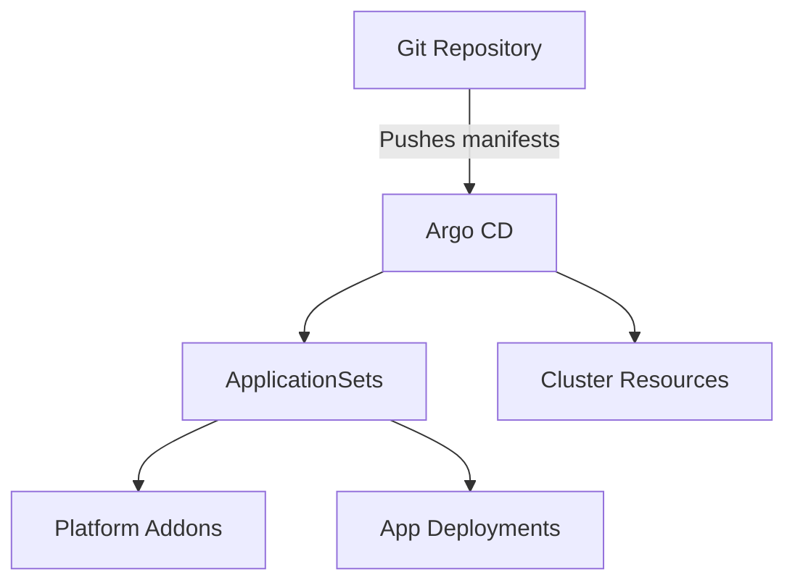

# Architecture Overview

Homelab as Code layers infrastructure automation, GitOps, and cluster services so every change is reproducible.

## Layered approach

1. **Layer 0**: Physical hardware and network connectivity.
2. **Layer 1**: Debian installs via preseed for consistent base OS.
3. **Layer 2**: Proxmox cluster configured with Ansible.
4. **Layer 3**: Infrastructure provisioned via Terragrunt and OpenTofu.
5. **Layer 4**: Talos Kubernetes cluster and GitOps bootstrap.

## GitOps flow

## Control plane and tooling

- **Proxmox** hosts the virtual machines that run Talos.
- **Talos Linux** provides an immutable, API-driven OS for Kubernetes.
- **Terragrunt/OpenTofu** manage infrastructure state and provisioning.
- **Ansible** configures Proxmox nodes and bootstraps prerequisites.
- **Task runner** orchestrates workflows through the Docker runner container.

## Networking and ingress

- **Cilium** provides CNI networking and network policy enforcement.
- **Istio** handles ingress routing and service mesh features.
- **Cloudflare tunnels** expose services securely without opening inbound ports.
- **Tailscale** provides secure access for provisioning and maintenance.

## Secrets and configuration

Bitwarden Secrets Manager stores bootstrap secrets. Terragrunt retrieves the initial token, then the external-secrets operator keeps runtime secrets synchronized. See [Bitwarden Access Tokens](bitwarden-access-tokens).

## Storage

TrueNAS runs as a VM for storage management. Kubernetes workloads can consume storage through the addons defined in [Kubernetes Addons](../reference/kubernetes-addons).

## Further reading

- [GitOps Workflow](gitops-workflow)
- [Networking Architecture](networking-architecture)
- [Secrets Management](secrets-management)
- [Storage Strategy](storage-strategy)
- [Security Model](security-model)
- [Runner Container Approach](runner-approach)
