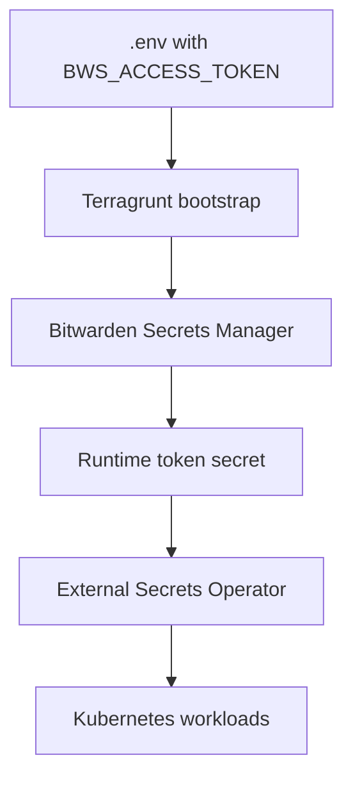

# Secrets Management

Secrets are bootstrapped from Bitwarden Secrets Manager and then synchronized into Kubernetes.

## Bootstrap flow

1. The bootstrap `BWS_ACCESS_TOKEN` is stored in `.env`.
2. Terragrunt uses it to retrieve the runtime token from Bitwarden.
3. The runtime token is applied as a Kubernetes secret.
4. External Secrets operator keeps secrets synchronized.

For details on the two-token architecture, see [Bitwarden Access Tokens](bitwarden-access-tokens).

## Runtime sync

- The external-secrets addon fetches secrets from Bitwarden.
- Secrets are mounted into workloads as Kubernetes secrets.

## Related docs

- [Configure Environment Variables](../how-to-guides/configure-env)
- [Environment Variables](../reference/environment-variables)
- [Troubleshooting](../how-to-guides/troubleshooting)
