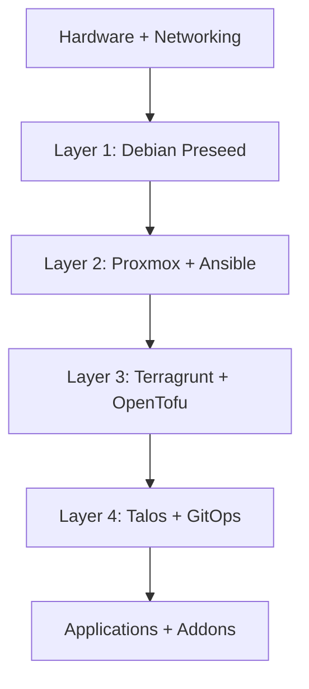

# Getting Started

This walkthrough gets you from a fresh clone to a bootstrapped Talos cluster.



## Step 1: Validate prerequisites

Review the required hardware, accounts, and tooling in [Prerequisites](../how-to-guides/prerequisites).

## Step 2: Clone the repository

```shell
git clone https://github.com/roib20/homelab-as-code.git
cd homelab-as-code
```

## Step 3: Build the runner image

```shell
task docker:build
```

See [Build the Runner Container](../how-to-guides/build-runner) for details.

## Step 4: Configure environment variables

```shell
cp env.example .env
```

Fill in tokens as described in [Configure Environment Variables](../how-to-guides/configure-env).

## Step 5: Bootstrap remote state

Run the R2 bootstrap before any Terragrunt workflows:

```shell
cd tofu/bootstrap-r2-bucket
./init.sh
```

See [Bootstrap the R2 Bucket](../how-to-guides/bootstrap-r2).

## Step 6: Follow the layered tutorials

Proceed through the layers in order:

1. [Layer 0: Hardware](Layers/Layer%200)
2. [Layer 1: Debian Preseed](Layers/Layer%201)
3. [Layer 2: Ansible (pve-cluster)](Layers/Layer%202)
4. [Layer 3: Terragrunt with OpenTofu](Layers/Layer%203)
5. [Layer 4: Taskfile (Talos Cluster)](Layers/Layer%204)

## Step 7: Verify the cluster

```shell
docker compose run --user "$(id -u):$(id -g)" --rm runner bash -c "task cluster:status"
```

## Next steps

- [Access Argo CD](../how-to-guides/access-argocd)
- [Add a New Application](../how-to-guides/add-application)
- [Troubleshooting](../how-to-guides/troubleshooting)
